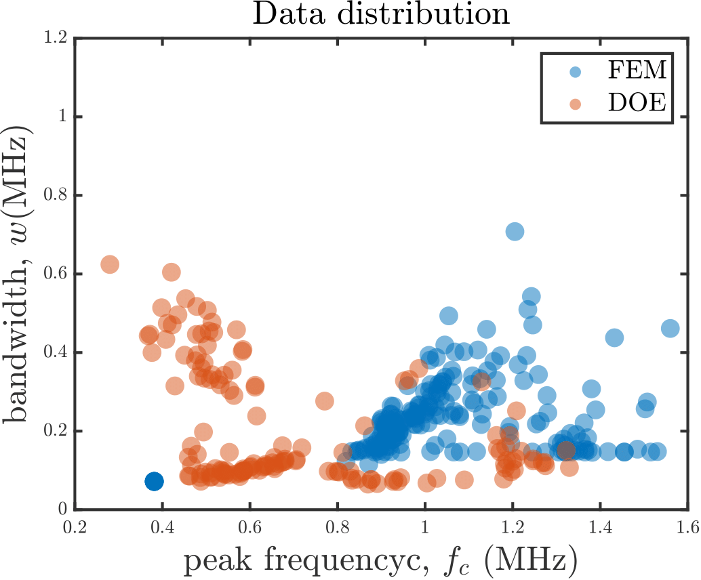

# AMSPnC Dataset
Autonomous Manufacturing of Phononic Crystals (AMSPnC) dataset containing two types of data. 

- Input features: 
    1. lattice distance, 
    2. filament diameter, 

- Output features: 
    1. center frequency of pass band, 
    2.  width of pass band, 

1. Source dataset (FEM data): This is a collection of Finite element method simulations of 4624 Phononic crystals (PnCs). The input feature values used to perform FEM simulation are: 

l_xy = 700 micrometer to 1035 micrometer at 5 micrometer discretization

d = 300 micrometer to 700 micrometer at 5 micrometer discretization

2. Target dataset (3d printed PnC samples): This is a collection of 144 3d printed Phononic crystals (PnCs). Here 3 samples are manufactured for each geometric configuration of the unit cell. The input feature values used to manufacture these artifacts are: 

l_xy = 700, 750, 800, 850, 900, 950, 1000, 1050 (dimension in micrometers)

d = 300, 350, 400, 450, 500, 550, 600 (dimension in micrometers)

## Description 
Tha final data can be found in the following files which are MATLAB data (.mat file)

     - bandgap_properties_FEM.mat: output features obtained from all FEM simulations, containes 4 columns: [l_xy, d, f_c, w]
     - bandgap_properties_FEM_shortened.mat: output features obtained from 48 FEM simulation with same input feature values as the experimental data, containes 4 columns: [l_xy, d, f_c, w]
     - bandgap_properties_exp.mat: output features obtained from 48 3D printed PnC artifacts with the above mentioned input feature values, we take the average of each 3 same samples to reduce the dataset from 144 samples to 48 samples, containes 4 columns: [l_xy, d, f_c, w]

1. FEM_data: Spectrum data of all FEM simulations
2. FFT_data: Frequency domain data of all 3D printed PnC artifacts
3. FFT_data_merged: Merged frequency domain data of all 3D printed PnC artifacts
4. Figures: Example figures obtained using the data
5. Reference_FFT_data: Frequency domain data of the reference signal at multiple locations  
6. Reference_TD_data: Time domain data of the reference signal at multiple locations 
7. TD_data: Time domain data of all 3D printed PnC artifacts
8. data_preprocessing: All MATLAB files used to preprocess the data to create the bandgap_properties

## Data collection procedure
Each artifact is 3d printed using PLA materials by the custom AMSPnC machine. PnC artifacts are characterized by two ultrasonic transducers. The bottom transducer sends ultrasonic sound waves through the PnC artifact and the top transducer receives the attenuated sound wave. Later this data is post processed using a data acquision unit. The time domain signal is converted to frequency domain signal using FFT. Later each FFT is compared against the reference FFT (signal obtained without any PnC artifact) and the ratio is called the spectral response of the PnC sample. To achieve better signal-to-noise ratio we send ultrasonic tone burst pulse at 5 different excitation frequencies and later combines them using frequency localizing basis functions. 

## Visualization
