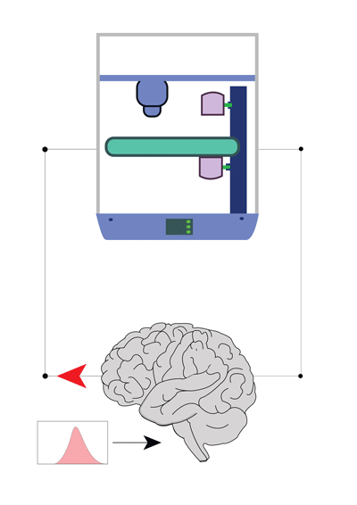
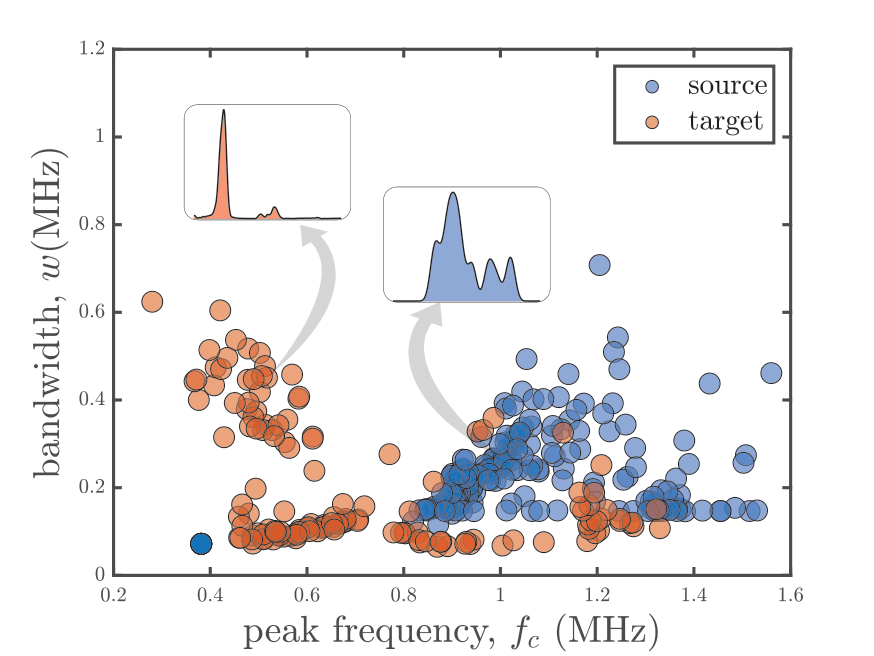

# Autonomous-Manufacturing
This repo contains all codes and related documentations for Autonomous Manufacturing project from HRL lab, MAE, OSU. THe cognitive unit folder contains all the learning algorithms. 

  
  

## Contributors: 
Md Ferdous Alam, Sarp Sezer

## Previous undergraduate interns:
Christina Duong

## References: 

1. Md Ferdous Alam, Max Shtein, Kira Barton & David J. Hoelzle, “[Reinforcement learning enabled autonomous manufacturing using transfer learning and probabilistic reward modeling](),” **([L-CSS (CDC) 2022]()**.
2. Md Ferdous Alam, Max Shtein, Kira Barton & David J. Hoelzle, “[Sample efficient transfer in reinforcement learning for high variable cost environments with an inaccurate source reward model](),” **([ACC 2022]())**.
3. Md Ferdous Alam, Max Shtein, Kira Barton & David J. Hoelzle, “[A  physics guided reinforcement learning framework for an autonomous manufacturing system with expensive data](),” **[ACC 2021](https://acc2021.a2c2.org/)**. 
4. Md Ferdous Alam, Max Shtein, Kira Barton & David J. Hoelzle, “[Autonomous Manufacturing Using Machine Learning: A Computational Case Study With a Limited Manufacturing Budget](https://asmedigitalcollection.asme.org/MSEC/proceedings-abstract/MSEC2020/84263/V002T07A009/1095697),” **[MSEC 2020]([https://event.asme.org/MSEC-2020](https://asmedigitalcollection.asme.org/MSEC/proceedings-abstract/MSEC2020/84263/V002T07A009/1095697?redirectedFrom=PDF))**. **Best paper award**

  

